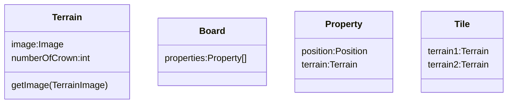

# Kingdomino Game Design

## Design diagram

```mermaid
classDiagram
class Terrain{
    image:Image
    numberOfCrown:int
    getImage(TerrainImage)
}

class Board{
properties:Property[]
}

class Property {
position:Position
terrain:Terrain
}

class Tile{
terrain1:Terrain
terrain2:Terrain
}
```